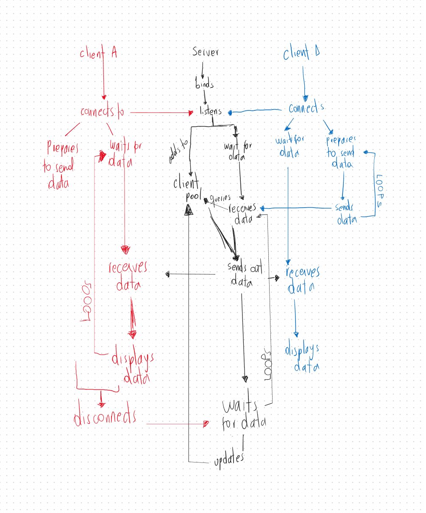

# Encrypted Chat

An app that demonstrates a client and server logic that features
chat capabilities and end-to-end encryption.

----
## Design specs

The following section describes how the programme works as well as any
information that might aid in understanding any and all decisions that
influence the design of the programme. 

The chapter is divided into two sections: chat and encryption. The former
aims at explaining the logic behind the sending and receiving of messages
amongst server and clients whilst the latter explains how data is encrypted.

### Chat

The following section has been further broken down into three parts. Each of
which deals with a different stage of the communication protocol.

#### Server and Clients go live

The chat feature is achieved, first of all, by the creation of server that
is able to listen for incoming connections, the clients. Once a client has
successfully connected to a server, the server adds it to a [`client pool`]
and waits for incoming data, a message.

On the other hand, after a client has reached the server and established
a connection, it becomes ready to both wait for incoming data and to send it
too.

Although it has been pointed out that a single thread would suffice for the
design at hand, in order to simulate the most optimal behaviour, a multithreaded
environment was chosen to serve as many clients as possible.

#### Relaying data

After a client has sent some data to the server, the server queries the client
pool for available clients and begins distributing the data amongst them.

Because the client pool must be queried before sending out data to it,
it is important to control the access that the rest of the components have.

It is also important to notice than in the current target implementation, a client
which has already disconnected WILL NOT receive any data that would have otherwise
been sent if it had remained connected. The main reason behind this design choice
is the potential added complexity that this feature would entail, which goes
far beyond the scope of this project.

It was additionally pointed out that it could go against the goal of the project as
this would likely mean that the server would be to hold onto the data for an undefined
period of time until the target client came back online, which would defeat the purpose
of end-to-end encryption. 

After the clients have received the data from the server, they process it and finally
display to the user. 

Both server and clients enter a loop state until going offline.

#### Client disconnects

In the event that a client disconnects from the server, the server removes it from the
client pool so that no more data it sent to it.

### Encryption

Pending
